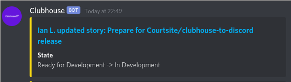
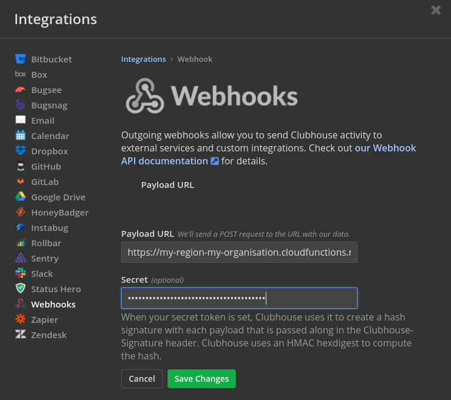
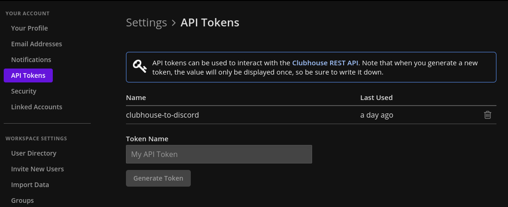

# clubhouse-to-discord

**This project is no longer maintained, and has been replaced with https://github.com/Courtsite/shortcut-to-teams**

📝 A simple Google Cloud Function in Go to transform / proxy [Clubhouse](https://clubhouse.io/) (Project Management) webhooks to [Discord](https://discordapp.com/).

_This project is still under development, and it does not handle many cases. It has been tested with the Go 1.13 runtime._

## Getting Started

### Prerequisites

- Ensure you have `gcloud` installed:
    - MacOS: `brew cask install google-cloud-sdk`
    - Others: https://cloud.google.com/sdk/gcloud
- Ensure you have authenticated with Google Cloud: `gcloud init`
- (Optional) Set your current working project: `gcloud config set project <project>`

### Deployment

1. Clone / download a copy of this repository
2. Copy `.env.sample.yaml` to `.env.yaml`, and modify the environment variables declared in the file
3. Run `./deploy.sh`
4. Configure Clubhouse webhooks integration in `https://app.clubhouse.io/<workspace>/settings/integrations/outgoing-webhook`

